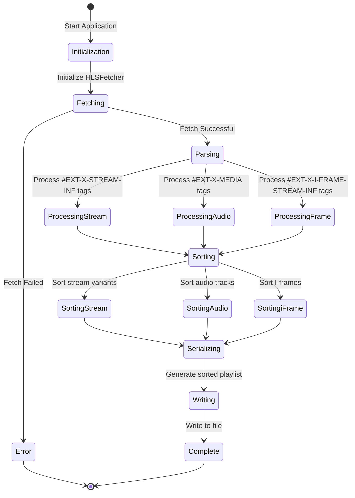
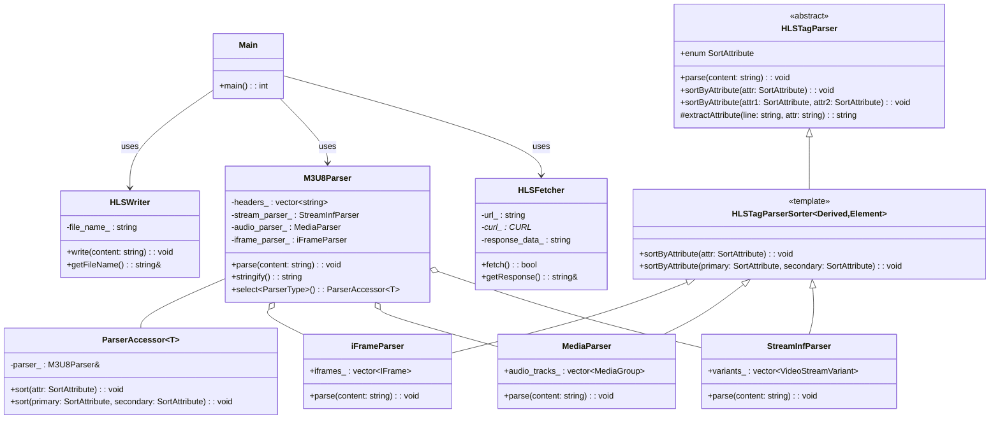

# Simple HLS Client

Mohamed Saleh's implementation of fetching an HLS playlist, parsing the document, and sorting it. 
A common use case in the Disney Streaming Services Video Platform Engineering group.

### My Goals

I wanted:
- the application to use powerful C++ features like templates, lambdas, and the STL.
- A clear separation of concerns between fetching, parsing, sorting, and writing functions.
- Extensible Design - new tag types can be supported by adding new parsers.
- RAII (Resource Acquisition Is Initialization) with appropriate constructors and destructors to handle resources like libcurl.
- An architecture that allows the HLS client to efficiently process HLS playlists while maintaining a clean, object-oriented design that separates distinct responsibilities into different components.

# Data Flow

Illustrated in the diagram below. The main function initializes an HLSFetcher to download the playlist.
The fetched content is passed to the M3U8Parser.
The parser delegates to sub-parsers to extract and organize different playlist elements.
Sorting is applied to each element type through the ParserAccessor.
The sorted playlist is serialized and written to a file using the HLSWriter.


# Structure

## Core Components
**HLSFetcher**: Handles HTTP requests using libcurl to retrieve HLS playlists from a URL. Provides methods to fetch content and retrieve response data

**M3U8Parser**: Central parsing component that coordinates the parsing of different HLS tag types. Contains three specialized sub-parsers, that can be accessed by a proxy.

**HLSWriter**: Handles writing the processed playlist content to a file.




## Sub-Parser Architecture:
**HLSTagParser**: Abstract base class defining the interface for all tag parsers

**HLSTagParserSorter**: Template class using CRTP (Curiously Recurring Template Pattern) to provide common sorting functionality
Concrete parsers that implement specific parsing logic

**StreamInfParser**: Processes video stream variants (#EXT-X-STREAM-INF tags)

**MediaParser**: Processes audio tracks (#EXT-X-MEDIA tags)

**iFrameParser**: Processes I-Frame only streams (#EXT-X-I-FRAME-STREAM-INF tags)


## Design Patterns Used
- Template Method Pattern: The abstract HLSTagParser defines the interface while HLSTagParserSorter provides partial implementation.
- CRTP (Curiously Recurring Template Pattern): Used in HLSTagParserSorter to achieve static polymorphism.
- Proxy Pattern: The ParserAccessor acts as a proxy to forward operations to the appropriate sub-parser.
- Strategy Pattern: The comparator functions in each parser provide different sorting strategies.


# Limitations
-  I have only tested this on macOS. Cannot guarantee support for other platforms.
- Sorting is done in ascending order only

## Assumptions
- Only supporting tag types present in the given HLS playlist file.
- Fetched HLS playlist to remain unchanged. New sorted HLS playlist file is created.

## Prerequisites
* **CMake v3.15+** - found at [https://cmake.org/](https://cmake.org/)
* **C++ Compiler** - needs to support at least the **C++11** standard, i.e. *MSVC*, *GCC*, *Clang*
* **CURL** - found at [everything curl](https://ec.haxx.se/install/index.html)


# Building Instructions
Generate the build system using a **CMake** routine similar to the one below:
```bash
cmake -S <source_directory> -B <build_directory>
```
- -S: Specifies the path to the directory containing the top-level CMakeList.txt
- -B: Specifies the path to the directory where build files will be generated

To build the project, all you need to do is run a **CMake** routine similar to the one below:
```bash
cd <build_directory>
cmake --build .
```

Alternatively, many IDEs have built-in support for CMake.

## Running Instructions


```bash
hls_fetch_and_sort
```
No command line options supported